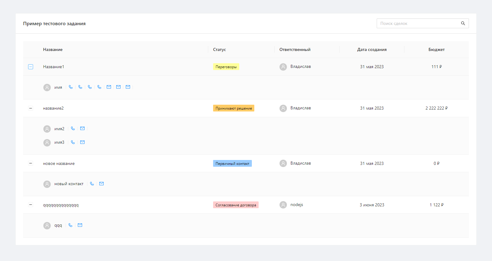

# AmoCRM
Интеграция amoCRM с сайтом API.

- На сайте amoCRM, создайте интеграцию, после заполнения данных предоставят ключи.

## Первый вариант запуска:
## Перед запуском
- В папке "backend" файл ".development.env" прописать полученные ключи amoCRM.
- Запустить программу MongoDBCompass, url "mongodb://localhost:27017", после захода на сайт будет каждый раз обновлять refresh token, чтобы каждый раз не обновлять код авторизации (CODE) в файле ".development.env".

## Команды запуска
- В папке "backend" выполнить команду "yarn install, yarn start" 
- В папке "frontend" выполнить команду "npm install, npm run dev" 

## Второй вариант запуска:
## Для запуска понадобится Docker:
- [Docker](https://www.docker.com/)
- В корневой папке файл "docker-compose.yml" прописать полученные ключи amoCRM, начиная с 25 строчки.

### Запустить:
```
docker-compose up -d
```

### Остановить:
```
docker-compose stop
```

## Перейти по адресу:
- [http://localhost:8080](http://localhost:8080)

## Доступ к mongoDB:
- [http://localhost:8081](http://localhost:8081)

## Пример как выглядит
